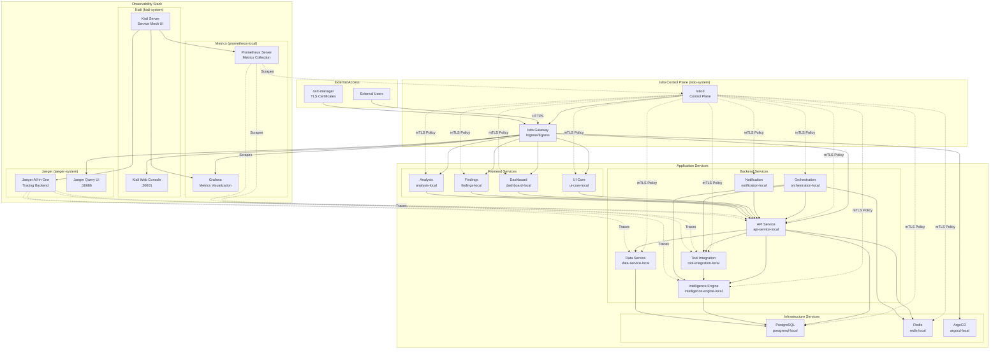

# Local Service Mesh Architecture

This document describes the Istio service mesh architecture implementation for the local development environment.

## 🏗️ Architecture Overview



## 🔧 Component Architecture

### Istio Control Plane
- **Namespace**: `istio-system`
- **Components**:
  - `istiod`: Control plane managing configuration, certificates, and proxy lifecycle
  - `istio-ingressgateway`: Entry point for external traffic
  - `istio-egressgateway`: Controlled egress traffic (optional)

### Service Mesh Configuration

#### Namespaces and Injection
All application namespaces have `istio-injection: enabled`:

| Namespace | Component | Sidecar Injection |
|-----------|-----------|-------------------|
| `api-service-local` | Backend API | ✅ |
| `tool-integration-local` | Security Tools | ✅ |
| `intelligence-engine-local` | AI/ML Engine | ✅ |
| `data-service-local` | Data Layer | ✅ |
| `notification-local` | Notifications | ✅ |
| `orchestration-local` | Workflow | ✅ |
| `ui-core-local` | UI Components | ✅ |
| `dashboard-local` | Dashboard | ✅ |
| `findings-local` | Findings UI | ✅ |
| `analysis-local` | Analysis UI | ✅ |
| `postgresql-local` | Database | ✅ |
| `redis-local` | Cache | ✅ |
| `argocd-local` | GitOps | ✅ |
| `jaeger-system` | Tracing | ✅ |
| `kiali-system` | Service Mesh UI | ✅ |
| `istio-system` | Control Plane | ❌ |

## 🔒 Security Architecture

### Mutual TLS (mTLS)
```yaml
# Global mTLS Policy
apiVersion: security.istio.io/v1beta1
kind: PeerAuthentication
metadata:
  name: default
  namespace: istio-system
spec:
  mtls:
    mode: STRICT
```

**Features**:
- All service-to-service communication encrypted
- Automatic certificate rotation
- Identity-based access control
- Zero-trust networking model

### Authorization Policies
```yaml
# Example: API Service Authorization
apiVersion: security.istio.io/v1beta1
kind: AuthorizationPolicy
metadata:
  name: api-service-authz
  namespace: api-service-local
spec:
  rules:
  - from:
    - source:
        namespaces: ["ui-core-local", "dashboard-local"]
    to:
    - operation:
        methods: ["GET", "POST"]
```

### Certificate Management
- **cert-manager**: Automated TLS certificate provisioning
- **Self-signed ClusterIssuer**: For local development
- **Wildcard Certificate**: `*.local.solidity-security.dev`

## 🌐 Traffic Management

### Gateway Configuration
```yaml
apiVersion: networking.istio.io/v1beta1
kind: Gateway
metadata:
  name: solidity-security-gateway
spec:
  selector:
    istio: ingressgateway
  servers:
  - port:
      number: 443
      name: https
      protocol: HTTPS
    hosts:
    - "*.local.solidity-security.dev"
    tls:
      mode: SIMPLE
      credentialName: solidity-security-local-tls-cert
```

### Virtual Services
| Service | External URL | Internal Target |
|---------|--------------|-----------------|
| Kiali | `kiali.local.solidity-security.dev` | `kiali.kiali-system.svc:20001` |
| Jaeger | `jaeger.local.solidity-security.dev` | `jaeger-query.jaeger-system.svc:16686` |
| Grafana | `grafana.local.solidity-security.dev` | `grafana.grafana-local.svc:3000` |
| Prometheus | `prometheus.local.solidity-security.dev` | `prometheus-server.prometheus-local.svc:9090` |
| ArgoCD | `argocd.local.solidity-security.dev` | `argocd-server.argocd-local.svc:80` |

### Traffic Policies

#### Circuit Breaker
```yaml
spec:
  trafficPolicy:
    connectionPool:
      tcp:
        maxConnections: 100
      http:
        http1MaxPendingRequests: 64
        maxRequestsPerConnection: 10
        maxRetries: 3
    outlierDetection:
      consecutiveGatewayErrors: 5
      baseEjectionTime: 30s
      maxEjectionPercent: 50
```

#### Load Balancing
- **Algorithm**: `LEAST_REQUEST`
- **Health Checks**: Automatic unhealthy instance removal
- **Retry Policy**: 3 attempts with exponential backoff

## 📊 Observability Architecture

### Distributed Tracing (Jaeger)
```yaml
# Istio Telemetry Configuration
apiVersion: telemetry.istio.io/v1alpha1
kind: Telemetry
metadata:
  name: default-tracing
spec:
  tracing:
  - providers:
    - name: jaeger
  - customTags:
      cluster: "local"
      environment: "local"
```

**Features**:
- 100% sampling for local development
- Automatic span generation for all HTTP requests
- Custom tags for environment identification
- Integration with Kiali for trace correlation

### Service Mesh Visualization (Kiali)
**Configuration**:
- **Authentication**: Anonymous (local development)
- **Prometheus**: `prometheus-server.prometheus-local.svc:9090`
- **Grafana**: `grafana.grafana-local.svc:3000`
- **Jaeger**: `jaeger-query.jaeger-system.svc:16686`

**Capabilities**:
- Real-time service topology
- Traffic flow visualization
- Configuration validation
- Health monitoring

### Metrics Collection
```yaml
# Istio Metrics Configuration
apiVersion: telemetry.istio.io/v1alpha1
kind: Telemetry
metadata:
  name: metrics
spec:
  metrics:
  - providers:
    - name: prometheus
  - overrides:
    - match:
        metric: REQUEST_COUNT
      tagOverrides:
        source_service: "%{SOURCE_SERVICE_NAME}"
        dest_service: "%{DESTINATION_SERVICE_NAME}"
```

## 🚀 Deployment Architecture

### ArgoCD Applications

| Application | Sync Wave | Purpose |
|-------------|-----------|---------|
| `service-mesh-crds-local` | 0 | Install CRDs for Istio, Jaeger, Kiali |
| `istio-service-mesh-local` | 1 | Deploy Istio control plane and gateways |
| `jaeger-tracing-local` | 2 | Deploy Jaeger tracing infrastructure |
| `kiali-observability-local` | 3 | Deploy Kiali service mesh UI |

### Kustomize Structure
```
k8s/
├── base/
│   ├── istio/           # Base Istio configuration
│   ├── jaeger/          # Base Jaeger configuration
│   └── kiali/           # Base Kiali configuration
└── overlays/local/
    ├── istio/           # Local-specific Istio config
    ├── jaeger/          # Local-specific Jaeger config
    ├── kiali/           # Local-specific Kiali config
    └── argocd/apps/     # ArgoCD application definitions
```

## 🔄 Data Flow Architecture

### Request Flow
1. **External Request** → Istio Gateway (HTTPS termination)
2. **Gateway** → Virtual Service (routing rules)
3. **Virtual Service** → Destination Rule (load balancing)
4. **Envoy Sidecar** → Application Pod (mTLS)
5. **Application** → Downstream Services (via service mesh)

### Observability Data Flow
1. **Envoy Sidecars** → Generate telemetry data
2. **Traces** → Sent to Jaeger via OTLP
3. **Metrics** → Scraped by Prometheus
4. **Logs** → Structured JSON to stdout
5. **Kiali** → Aggregates data from Prometheus, Jaeger, Grafana

## 🎯 Design Decisions

### Service Mesh Scope
- **Included**: All application and infrastructure services
- **Excluded**: Control plane components (ArgoCD, Prometheus, Grafana control pods)
- **Rationale**: Maximize observability while avoiding control plane complexity

### Security Model
- **mTLS Everywhere**: STRICT mode for all inter-service communication
- **Zero Trust**: No implicit trust between services
- **Certificate Automation**: cert-manager handles TLS lifecycle

### Observability Strategy
- **Full Tracing**: 100% sampling for development visibility
- **Rich Metrics**: Custom tags for environment and service identification
- **Centralized Visualization**: Single pane of glass via Kiali

### Performance Considerations
- **Circuit Breakers**: Prevent cascade failures
- **Connection Limits**: Resource protection
- **Retry Policies**: Resilience with backpressure

## 📋 Resource Requirements

### Minimum Cluster Requirements
- **CPU**: 6 cores (8 cores recommended)
- **Memory**: 16GB RAM (24GB recommended)
- **Storage**: 50GB available disk space
- **Kubernetes**: v1.28+ with ingress controller

### Component Resource Allocation
| Component | CPU Request | Memory Request | CPU Limit | Memory Limit |
|-----------|-------------|----------------|-----------|--------------|
| Istiod | 500m | 2048Mi | - | - |
| Istio Gateway | 100m | 128Mi | 2000m | 1024Mi |
| Jaeger | 200m | 256Mi | 500m | 512Mi |
| Kiali | 100m | 128Mi | 200m | 256Mi |
| Envoy Sidecars | 100m | 128Mi | 2000m | 1024Mi |

## 🔗 Integration Points

### External Systems
- **cert-manager**: TLS certificate lifecycle
- **ArgoCD**: GitOps deployment automation
- **Prometheus**: Metrics collection and alerting
- **Grafana**: Metrics visualization and dashboards

### Service Dependencies
- **Kiali** requires Prometheus, Jaeger, Grafana
- **Jaeger** requires persistent storage (memory for local)
- **Istio** requires cert-manager for gateway TLS
- **All components** require properly labeled namespaces

## 🛠️ Maintenance and Operations

### Configuration Updates
- Changes made via Kustomize overlays
- Deployed through ArgoCD applications
- Automatic sync with Git repository changes

### Certificate Rotation
- Automatic via cert-manager
- 90-day renewal cycle for local certificates
- No manual intervention required

### Monitoring and Alerting
- Service mesh health via Kiali dashboards
- Prometheus alerts for component failures
- Grafana dashboards for performance monitoring

## 📚 References

- [Istio Architecture Documentation](https://istio.io/latest/docs/ops/deployment/architecture/)
- [Jaeger Architecture](https://www.jaegertracing.io/docs/1.52/architecture/)
- [Kiali Architecture](https://kiali.io/docs/architecture/)
- [Service Mesh Troubleshooting](../user-guides/service-mesh-troubleshooting.md)